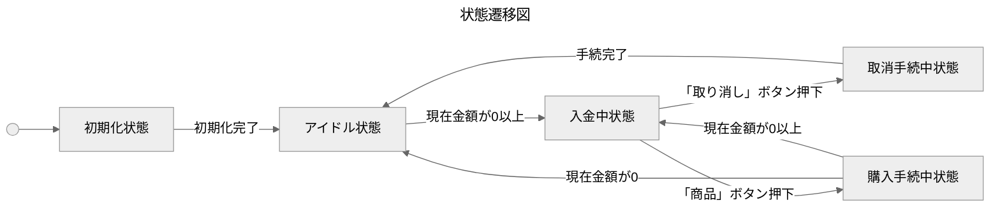
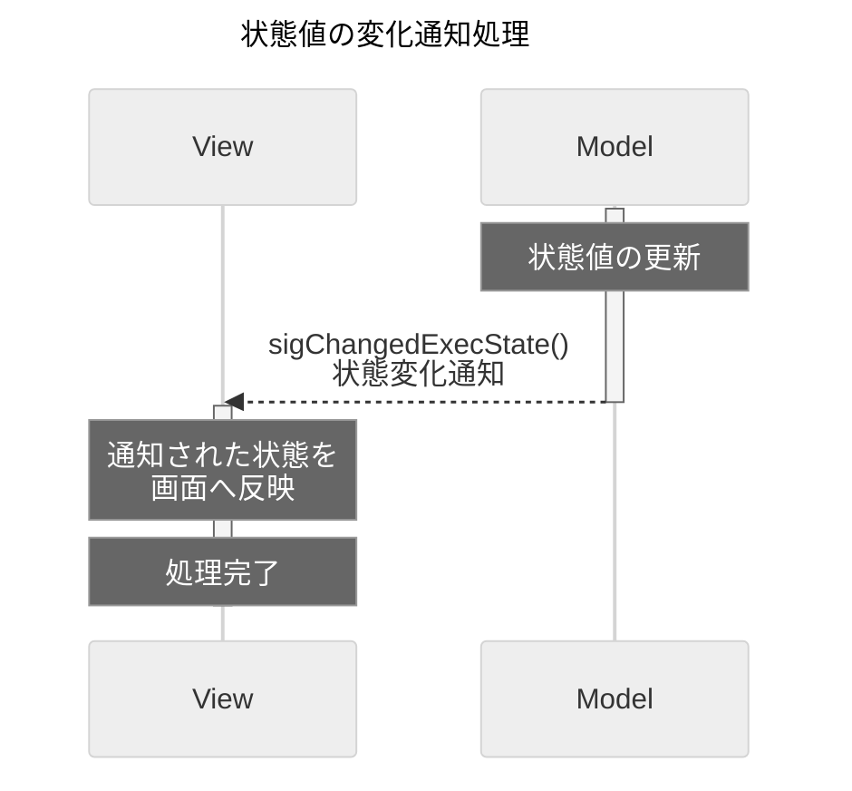
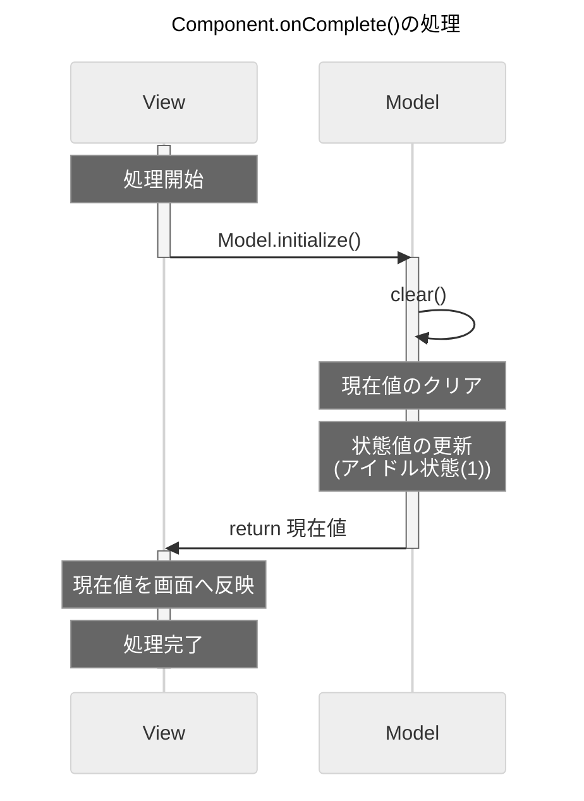
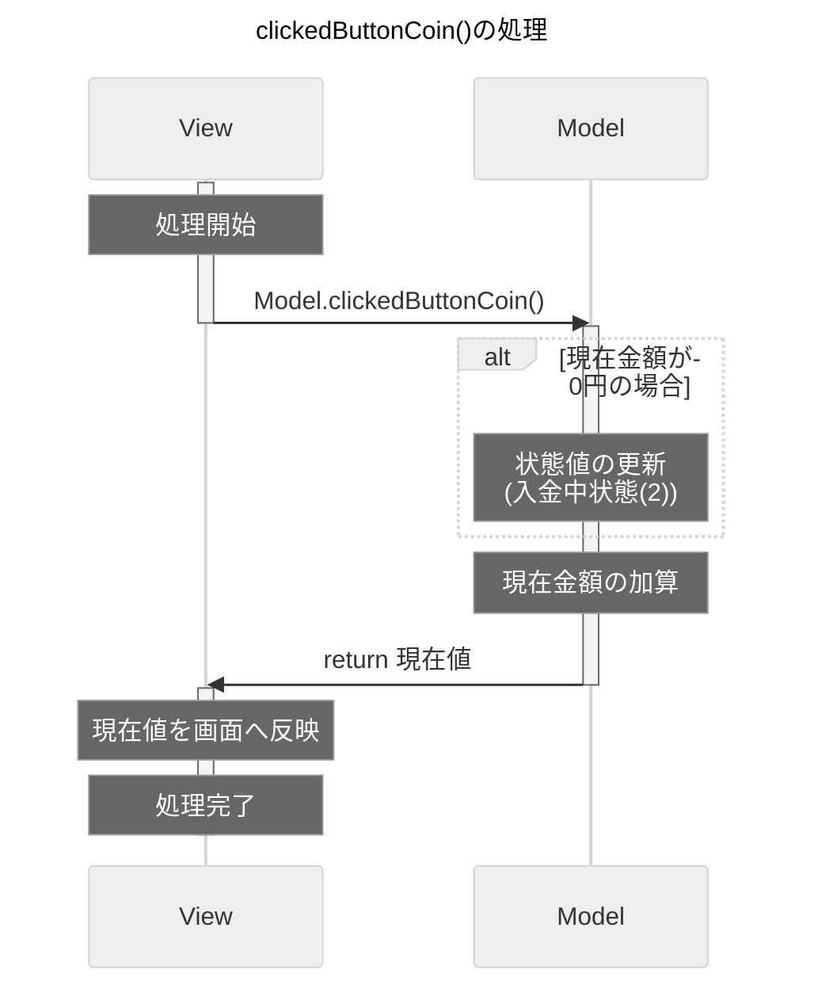
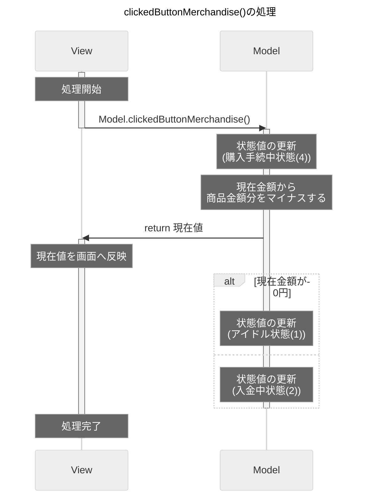

# 処理シーケンスメモ

-----

## 目次

<!-- @import "[TOC]" {cmd="toc" depthFrom=2 depthTo=6 orderedList=false} -->
<!-- code_chunk_output -->

- [状態遷移図](#状態遷移図)
- [状態変化通知](#状態変化通知)
- [初期化処理](#初期化処理)
- [入金ボタン押下処理](#入金ボタン押下処理)
- [商品ボタン押下処理](#商品ボタン押下処理)
- [取り消しボタン押下処理](#取り消しボタン押下処理)

<!-- /code_chunk_output -->

 

-----

## 状態遷移図

 
 

[目次へ](#目次)

-----

## 状態変化通知

 
 

[目次へ](#目次)

-----

## 初期化処理

 
 

[目次へ](#目次)

-----

## 入金ボタン押下処理

 
 

[目次へ](#目次)

-----

## 商品ボタン押下処理

 
 

[目次へ](#目次)

-----

## 取り消しボタン押下処理

 
 

[目次へ](#目次)

-----
