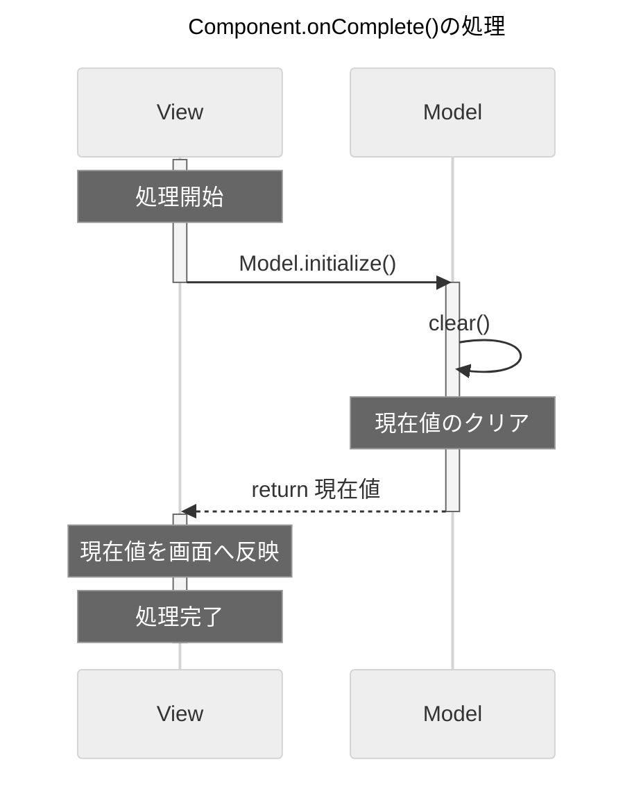
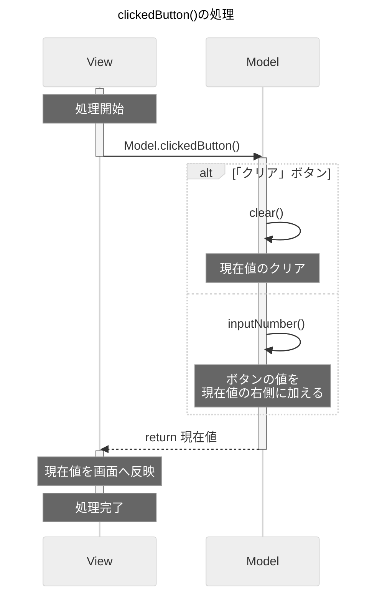

# 処理シーケンスメモ

-----

## 目次

<!-- @import "[TOC]" {cmd="toc" depthFrom=2 depthTo=6 orderedList=false} -->
<!-- code_chunk_output -->

- [初期化処理](#初期化処理)
- [ボタン押下処理](#ボタン押下処理)

<!-- /code_chunk_output -->

 

-----

## 初期化処理

 
 

[目次へ](#目次)

-----

## ボタン押下処理

 
 

[目次へ](#目次)

-----

